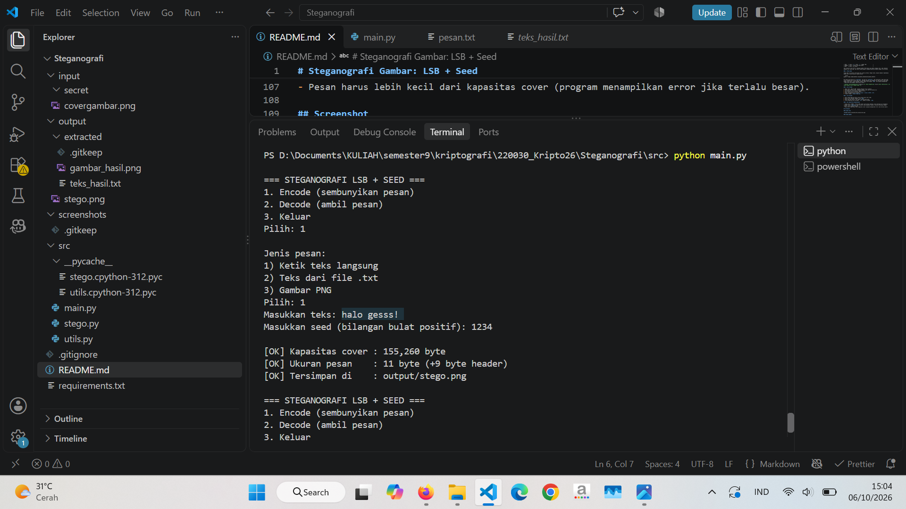
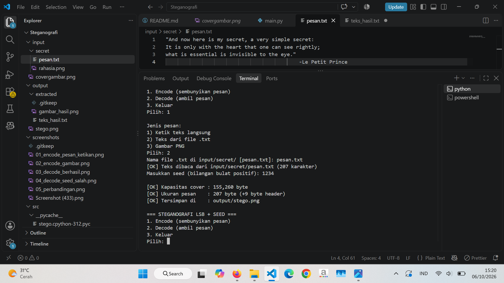
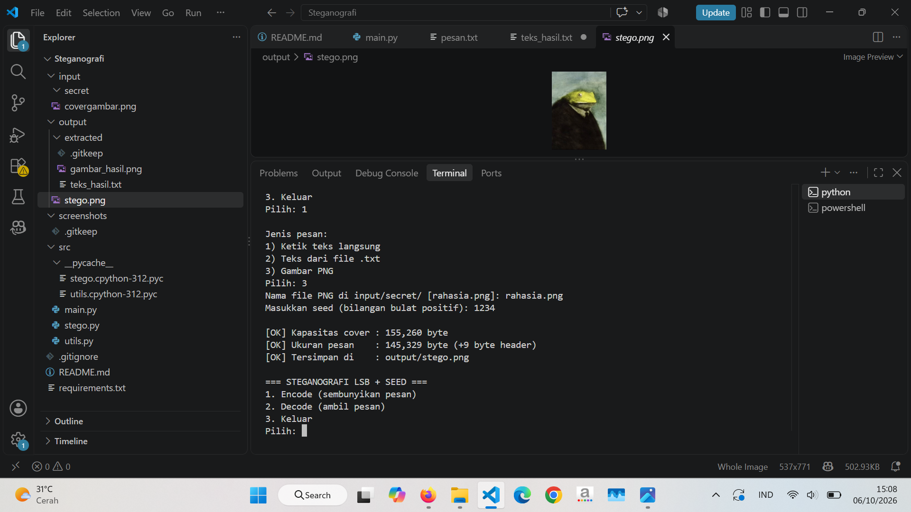
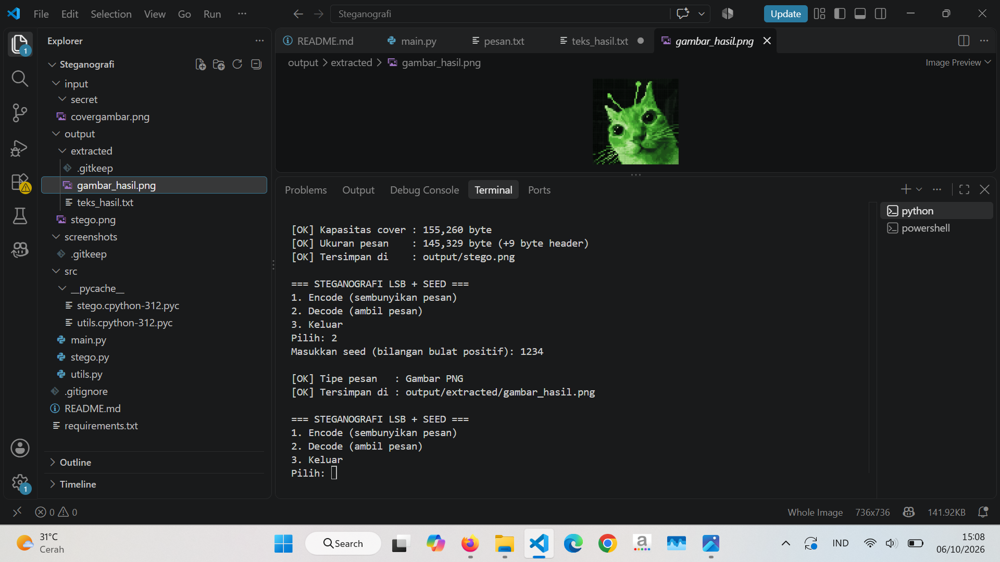
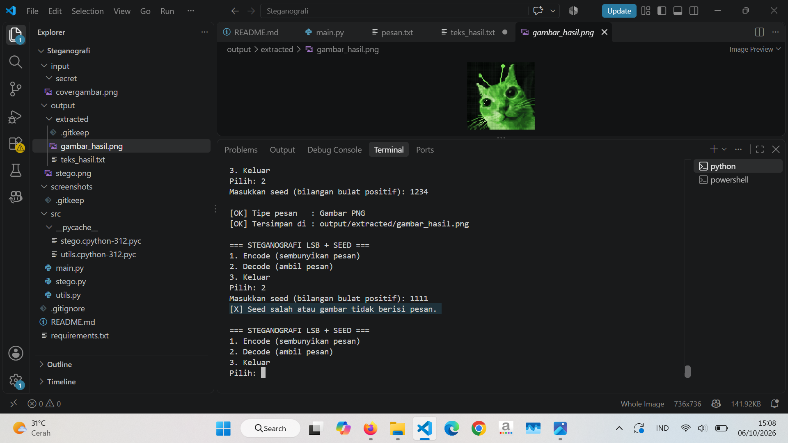
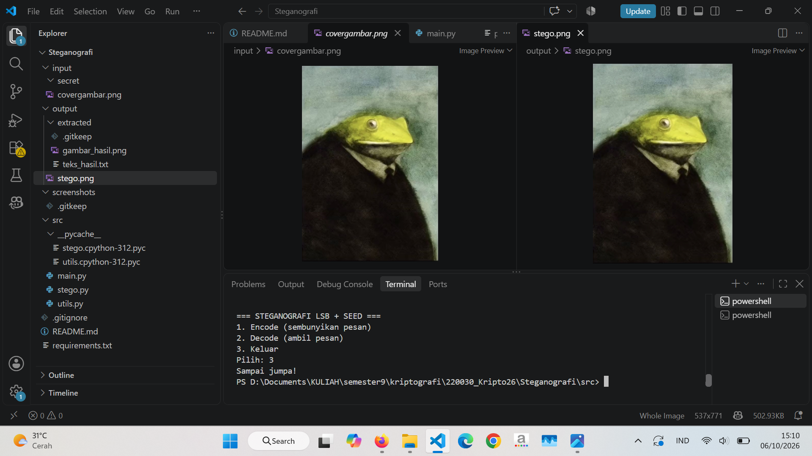

# Steganografi Gambar: LSB + Seed

Tugas Mata Kuliah Kriptografi. Program CLI berbahasa Python untuk **menyembunyikan teks atau gambar PNG** di dalam gambar cover, memakai metode **LSB (Least Significant Bit)** dengan **posisi bit diacak oleh seed**.

- Nama : Jannatul Salsabila Putri Sanesa
- NIM : 140810220030

## Fitur

- Menyembunyikan **teks** (diketik atau dari file `.txt`, UTF-8) atau **gambar PNG** ke dalam `covergambar.png`
- Posisi penyimpanan bit diacak memakai **seed** (angka), berfungsi seperti kunci
- Deteksi otomatis jika seed salah atau gambar tidak berisi pesan
- Pengecekan kapasitas cover
- Output berupa **PNG** (lossless)

## Struktur Folder

```
steganografi-kriptografi/
├── src/
│   ├── main.py          # Menu CLI
│   ├── stego.py         # Logika encode & decode
│   └── utils.py         # bytes<->bits, header
├── input/
│   ├── covergambar.png  # Gambar cover
│   └── secret/          # Pesan rahasia (pesan.txt, rahasia.png)
├── output/
│   ├── stego.png        # Hasil encode
│   └── extracted/       # Hasil decode
├── screenshots/         # Screenshot running program
├── requirements.txt
└── README.md
```

## Cara Menjalankan

```bash
pip install -r requirements.txt
cd src
python main.py
```

1. **Encode**: pilih menu 1, pilih jenis pesan (ketik teks / teks dari file `.txt` / gambar PNG), masukkan seed. Hasil: `output/stego.png`.
2. **Decode**: pilih menu 2, masukkan seed yang **sama**. Hasil: tampil di layar dan tersimpan di `output/extracted/`.

Untuk pesan dari file (`.txt` UTF-8 atau `.png`), taruh file di `input/secret/` lalu ketik namanya saat diminta (cukup tekan Enter untuk memakai `pesan.txt` / `rahasia.png`).

## Cara Kerja

### 1. Konsep LSB

Setiap piksel gambar RGB punya 3 nilai warna (R, G, B), masing-masing 8 bit (0-255). **Bit paling kanan (LSB)** diganti dengan satu bit pesan. Perubahan nilai warna paling besar hanya ±1, sehingga tidak terlihat oleh mata.

```
Nilai R asli     : 1011010 0
Bit pesan        : 1
Nilai R stego    : 1011010 1
```

Kapasitas cover = `lebar × tinggi × 3` bit.

### 2. Format Data yang Disisipkan

Sebelum pesan, ditambahkan header agar decoder tahu apa yang harus dibaca:

| Bagian | Ukuran | Isi                                       |
| ------ | ------ | ----------------------------------------- |
| MAGIC  | 4 byte | `STEG`, penanda bahwa gambar berisi pesan |
| TIPE   | 1 byte | `0` = teks, `1` = gambar PNG              |
| UKURAN | 4 byte | Jumlah byte data pesan                    |
| DATA   | N byte | Isi pesan                                 |

Teks diubah ke byte UTF-8, sedangkan gambar PNG dibaca apa adanya sebagai byte. Jadi keduanya memakai alur yang sama, dan hasil decode gambar **identik byte per byte** dengan file aslinya.

### 3. Peran Seed

Tanpa seed, bit ditulis berurutan dari piksel pertama. Dengan seed, program membuat **permutasi acak** dari seluruh posisi channel warna:

```python
posisi = numpy.random.default_rng(seed).permutation(jumlah_channel)
```

Bit pesan ke-0 ditulis di `posisi[0]`, bit ke-1 di `posisi[1]`, dan seterusnya. Seed yang sama selalu menghasilkan urutan yang sama, sehingga decoder bisa membaca bit pada posisi yang tepat. Dengan seed salah, urutan berbeda, header tidak cocok dengan `STEG`, dan program menampilkan _"Seed salah atau gambar tidak berisi pesan."_

> Catatan: seed menyembunyikan **lokasi** bit, bukan mengenkripsi **isi** pesan (obfuscation). Ini sudah memadai untuk lingkup tugas ini.

### 4. Alur Encode

1. Baca cover, ubah ke RGB, ratakan menjadi array 1 dimensi.
2. Ubah pesan menjadi byte, tambahkan header, lalu ubah ke deretan bit.
3. Cek kapasitas; jika kurang, tampilkan error.
4. Buat urutan posisi acak dari seed.
5. Ganti LSB pada posisi tersebut: `nilai = (nilai & 0xFE) | bit`.
6. Simpan sebagai `output/stego.png`.

### 5. Alur Decode

1. Baca stego-image dan buat ulang urutan posisi dari seed.
2. Baca 72 bit pertama (header), cek `STEG`.
3. Baca tipe dan ukuran, lalu ambil sejumlah byte data.
4. Teks ditampilkan dan disimpan `.txt`, gambar disimpan `.png`.

### 6. Hal yang Perlu Diperhatikan

- Output harus **PNG**. Format JPEG tidak cocok karena kompresi lossy merusak bit tersembunyi.
- Jangan kirim `stego.png` lewat aplikasi yang mengompres gambar (misalnya WhatsApp sebagai "foto"), kirim sebagai dokumen.
- Pesan harus lebih kecil dari kapasitas cover (program menampilkan error jika terlalu besar).

## Screenshot

### Encode teks



### Encode pesan



### Encode gambar



### Decode (seed benar)



### Decode (seed salah)



### Perbandingan cover vs stego


